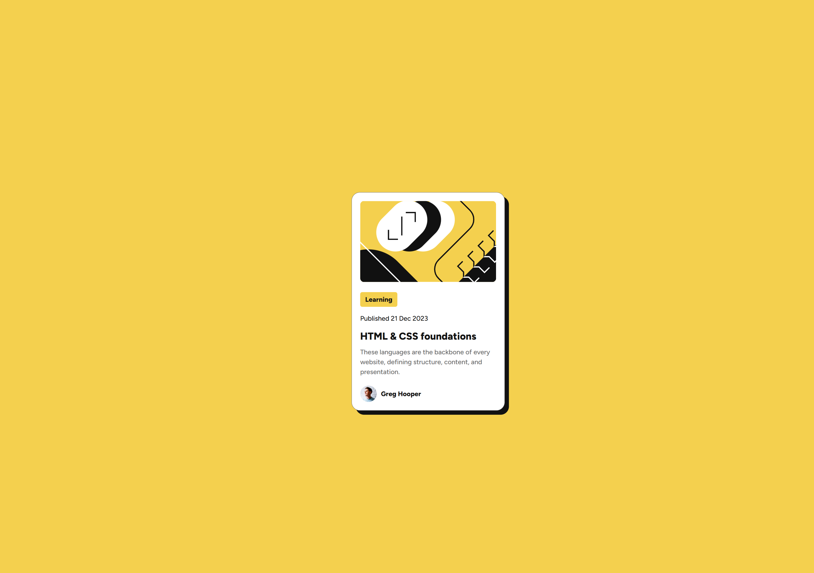

# Frontend Mentor - Blog preview card solution

This is a solution to the [Blog preview card challenge on Frontend Mentor](https://www.frontendmentor.io/challenges/blog-preview-card-ckPaj01IcS). Frontend Mentor challenges help you improve your coding skills by building realistic projects.

## Table of contents

- [Overview](#overview)
  - [The challenge](#the-challenge)
  - [Screenshot](#screenshot)
  - [Links](#links)
- [My process](#my-process)
  - [Built with](#built-with)
  - [What I learned](#what-i-learned)
  - [Continued development](#continued-development)
  - [Useful resources](#useful-resources)
- [Author](#author)
- [Acknowledgments](#acknowledgments)

## Overview

This project is a solution to the Blog Preview Card challenge from Frontend Mentor. The goal was to create a visually appealing and accessible blog preview card using HTML and CSS only. The card displays a blog post preview, including an image, category, title, description, author information, and an interactive state. The project emphasizes responsive design, semantic HTML, and clean, maintainable CSS. It serves as a practical exercise in component-based UI development and reinforces best practices in frontend development.

### The challenge

Users should be able to:

- See hover and focus states for all interactive elements on the page

### Screenshot




### Links

- Solution URL: [https://github.com/remainhumble/Blog-preview-card]
- Live Site URL: [https://remainhumble.github.io/Blog-preview-card/]

## My process

I began by carefully reviewing the project requirements and design files provided by Frontend Mentor. I set up the project structure using semantic HTML5 and organized my CSS with custom properties for easy theming. I implemented a mobile-first approach, starting with the layout for smaller screens and progressively enhancing it for larger devices using Flexbox. Throughout the process, I regularly tested the component in two different screen sizes to ensure responsiveness. I also made use of version control with Git to track my progress and manage changes efficiently.

### Built with

- Semantic HTML5 markup
- CSS custom properties
- Flexbox
- Mobile-first workflow

### What I learned

One key takeaway from this project was learning how to implement accessible hover and focus states for an interactive element. Outside of working on this project, I found out how to use CSS pseudo-classes like `:hover` and `:focus` to provide clear visual feedback for users interacting with interactive elements. This not only improves the user experience but also enhances accessibility for keyboard and assistive technology users. I also learned the importance of ensuring that focus outlines are visible and meet contrast requirements, making the component more inclusive.

To see how you can add code snippets, see below:

```css
a {
  text-decoration: none;
  color: var(--Gray-950);
}

a:hover {
  color: hsl(47, 88%, 63%);
  cursor: pointer;
}

a:focus {
  outline: 2px solid hsl(47, 88%, 63%);
}
```

### Continued development

In future projects, I want to continue improving my skills in the following areas:

- Enhancing accessibility, especially for keyboard navigation and screen readers.
- Deepening my understanding of responsive design techniques for a wider range of devices.
- Refining my use of CSS custom properties and exploring advanced CSS features.
- Improving component reusability and maintainability in my codebase.
- Practicing more with semantic HTML to ensure better structure and SEO.

These focus areas will help me build more robust, user-friendly, and scalable web components.

### Useful resources

- [Bro Code - YouTube](https://www.youtube.com/@BroCodez) - Coding bootcamps HATE him!
  See how he can teach you to code.
  His channel is dedicated to providing free education to those that cannot afford college, bootcamps, and overpriced crap coding gurus try to sell you.
- [Frontend Mentor Community](https://www.frontendmentor.io/community) - Great place to ask questions and see how others approach similar challenges.
- [Google Fonts](https://fonts.google.com/) - Used for selecting and implementing web fonts in the project.
- [GitHub Docs - Getting Started with Git](https://docs.github.com/en/get-started/quickstart) - Useful for managing version control throughout the project.

## Author

- Frontend Mentor - [@remainhumble](https://www.frontendmentor.io/profile/remainhumble)
- X(formerly Twitter) - [@thiflan120699](https://x.com/thiflan120699)
